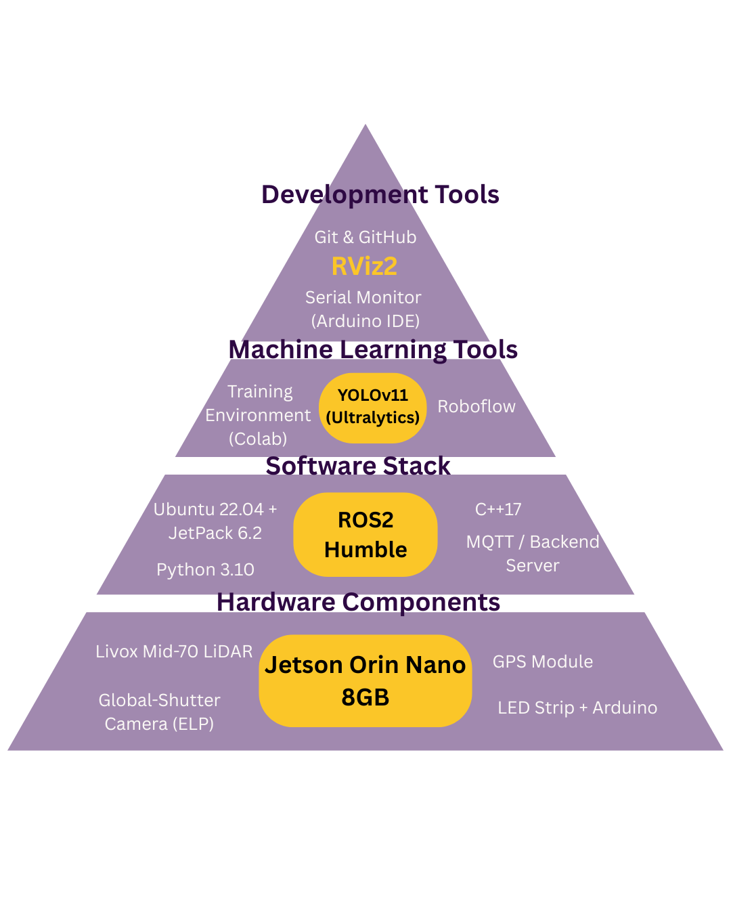
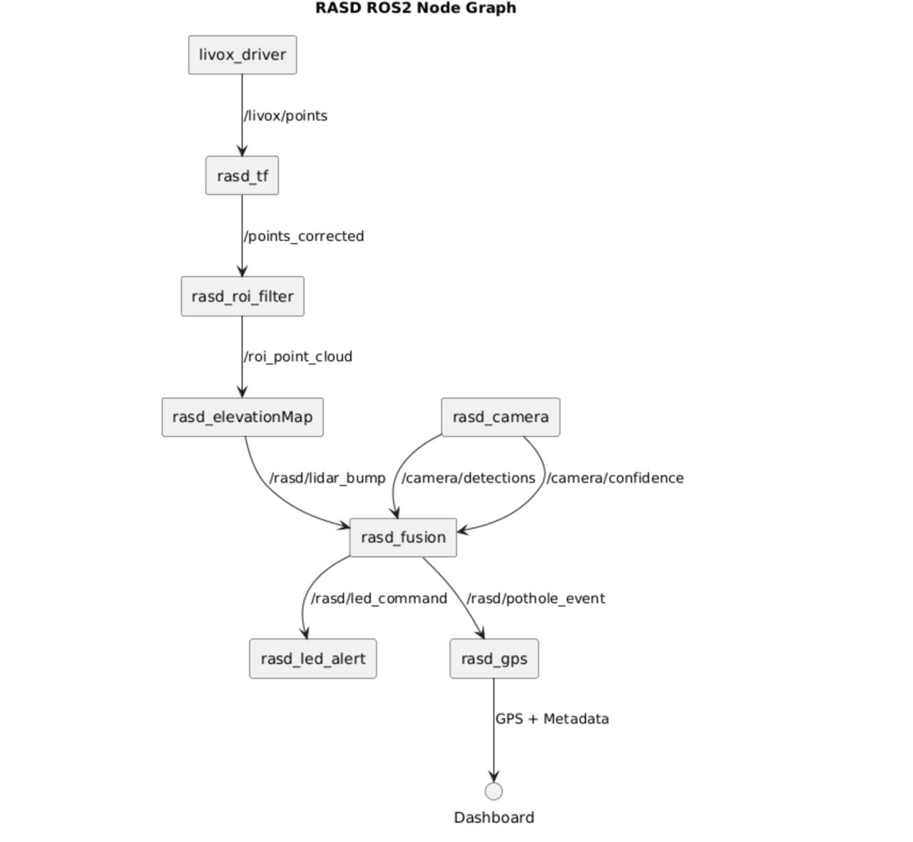
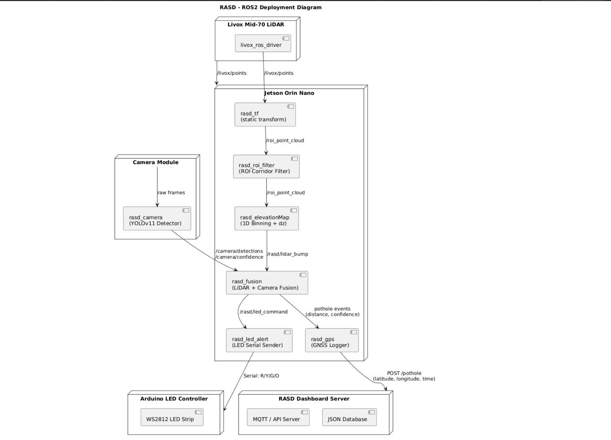

# Real-Time Autonomous Safety Detector (RASD)

The **Real-Time Autonomous Safety Detector** is an AI-powered road anomaly detection system designed for Shell Eco-Marathon and autonomous safety applications.  
It integrates:

- **LiDAR-based speed bump detection**
- **Camera-based pothole detection**
- **Real-time driver alert logic**
- **Cloud dashboard reporting**

This repository contains the ROS2 nodes, detection models, Google Colab training notebooks, and all project documentation.

---

# 📌 Prioritized User Story Backlog

## User Stories Table

| ID  | Title                                                   | User Story (IEEE format)                                                                                                                                                                                 | Priority | Acceptance Criteria                                                                                                                                                                                                                                                   |
| --- | ------------------------------------------------------- | -------------------------------------------------------------------------------------------------------------------------------------------------------------------------------------------------------- | -------- | --------------------------------------------------------------------------------------------------------------------------------------------------------------------------------------------------------------------------------------------------------------------- |
| **S1**  | Speed Bump Detection Morning                            | As a driver commuting in the morning, I want the system to detect speed bumps so that I can slow down safely.                                                                                            | High     | System detects speed bumps under normal visibility. Driver is prompted to reduce speed before crossing.                                                                                                                                                             |
| **P1**  | Pothole Detection at Morning                            | As a driver commuting in the morning, I want the system to detect potholes ahead so that I can reduce speed smoothly.                                                                                    | High     | System detects potholes in clear conditions. Driver is alerted early enough to reduce speed safely. Pothole is logged with GPS for reporting.                                                                                                                    |
| **S2**  | Speed Bump Detection Night                              | As a driver at night, I want the system to recognize even unmarked bumps so that I am warned early.                                                                                                      | High     | System identifies both marked and unmarked bumps at night. Driver receives a clear and timely warning. Detection accuracy remains high.                                                                                                                         |
| **P2**  | Pothole Detection at Night                              | As a driver traveling at night, I want the system to detect potholes in low visibility so that I can avoid sudden swerves.                                                                               | High     | System functions reliably under low-light conditions. Driver is alerted early enough to reduce speed safely. Pothole is logged with GPS and timestamp for reporting.                                                                                            |
| **Ex1** | Extreme Weather Detection                               | As a driver in rain or sandstorms, I want bumps and potholes detected so that I can ensure safety.                                                                                                       | Medium   | Detection accuracy remains acceptable in rain or dust. Alerts are still delivered in real time.                                                                                                                                                                     |
| **D1**  | Municipality Dashboard Map Integration                  | As a Riyadh Municipality road maintenance officer, I want the system to display detected potholes on a live dashboard map so that I can identify hazardous locations and prioritize repairs efficiently. | Low      | Dashboard shows all potholes detected within Riyadh. Each pothole appears with location + timestamp. Users can filter potholes by date or status (unresolved/resolved).                                                                                          |

---

# 📌 Non-Functional Requirements

### **Reliability**
- System must operate continuously for 24/7 usage in city-wide deployment.
- Sensor fusion must remain stable even under vibration and high temperatures.

### **Usability**
- Alerts must be simple, color-coded, and instantly clear to the driver.
- Visualizations on the dashboard must be intuitive and easy to interpret.

### **Scalability**
- Capable of handling large volumes of anomaly detections across multiple users.
- Dashboard back-end supports real-time updates from many vehicles.

### **Maintainability**
- ROS2 nodes must be modular and easy to update.
- YOLO and LiDAR algorithms should be replaceable without breaking the pipeline.

---

# 📌 System Overview (High-Level Summary)

The RASD system consists of:

### **1. LiDAR Speed Bump Detection (ROS2 C++ Node)**
- ROI filtering  
- Ground plane estimation  
- Elevation-profile analysis  
- Early vs. strong confidence detection  
- RViz markers + LED alert pipeline  

### **2. Camera Pothole Detection (YOLOv11/12)**
- Global-shutter camera  
- ROI cropping  
- ByteTrack temporal filtering  
- EMA smoothing for stability  
- Optimized for Jetson Orin Nano  

### **3. Sensor Fusion Node**
Combines:
- LiDAR bump confidence  
- YOLO pothole detections  
- Distance estimation  
- Temporal filtering  
- Single unified warning output  

### **4. LED Alert Node**
- Green / Yellow / Red alert system  
- Configurable distance thresholds  
- Serial or SPI communication  

### **5. Cloud Reporting (Optional)**
- MQTT telemetry  
- Plotly dashboard  
- GPS logging  
- Municipality reporting API  

---

---

# 📦 Repository Architecture & Folder Breakdown

This repository contains the complete ROS2 implementation of the **Real-Time Autonomous Safety Detector (RASD)**.  
Below is a detailed explanation of each folder and its role in the system.

## 📁 Top-Level Repository Structure

RASD/
├── src/ # Main ROS2 workspace packages
│ ├── rasd_camera/ # Camera-based pothole detection (YOLOv11)
│ ├── rasd_roi_filter/ # LiDAR ROI corridor filtering
│ ├── rasd_elev_profile/ # 1D elevation profile (dz) bump detection
│ ├── rasd_ransac_speedbump/ # Alternative RANSAC bump detector (deprecated)
│ ├── rasd_gridmap/ # Grid-map conversion of LiDAR slices
│ ├── rasd_fusion/ # Sensor fusion (LiDAR + Camera → final alerts)
│ ├── rasd_led_serial/ # LED strip alert sender (serial)
│ ├── rasd_gps/ # GNSS logging & GPS event publishing
│ ├── rasd_tf/ # Static transform publisher (base_link → livox)
│ ├── livox_ros2_driver/ # Official Livox driver (points → /livox/points)
│ └── grid_map/ # Dependencies for elevation/grid-map processing
│
├── log/ # ROS2 build/run logs (should be ignored)
├── build/ # Colcon build output
├── install/ # Installed ROS2 environments
├── documentation/ # Reports, sprint notes, diagrams
├── models/ # YOLO models (.pt)
└── README.md # Project overview & documentation

---

# 🧠 How RASD Works (System Overview)

RASD uses an ADAS-grade 1D longitudinal elevation-profile pipeline to detect both upward deviations (speed bumps) and downward depressions (potholes) by fitting a robust ground plane using Least-Squares (LSQ) and Median Absolute Deviation (MAD) filtering to remove outliers. The ROI-filtered LiDAR corridor is projected into evenly spaced forward bins, where the system computes the per-bin median height and Δz slope to identify local geometric anomalies. These LiDAR elevation cues are temporally smoothed using exponential filtering and confidence accumulation to eliminate false spikes. In parallel, the camera performs YOLO-based semantic detection of potholes, whose results are fused with LiDAR geometric evidence in a temporal fusion node that resolves final hazard type, distance, and confidence. The system outputs a unified anomaly event to the LED alert module and GPS logger for real-time driver warnings and dashboard reporting.
---

# 🔧 Hardware & Software Stack

The diagram below summarizes the entire stack used in RASD:

### **Hardware Layer**
- **Livox Mid-70 LiDAR**  
  High-density 3D point cloud for detecting speed bumps.
- **Global Shutter Camera (ELP)**  
  Handles pothole detection using YOLOv11.
- **Jetson Orin Nano (8GB)**  
  Runs all ROS2 nodes, ML inference, filtering, and fusion.
- **GPS Module**  
  Attaches metadata for municipality reports.
- **WS2812 LED Strip + Arduino**  
  Real-time visual warnings (Green/Yellow/Red).

### **Software Stack**
- **Ubuntu 22.04 + JetPack 6.2**
- **ROS2 Humble** (core middleware)
- **C++17 & Python 3.10**
- **MQTT / Flask backend** (optional)
- **YOLOv11 (Ultralytics)**  
- **Colab + Roboflow training**  

---

# 🔄 RASD ROS2 Node Graph

This diagram shows the flow of messages between all RASD ROS2 nodes:

### **Flow Explanation**

1. **livox_ros_driver → rasd_tf**  
   Raw LiDAR points converted into base_link frame.

2. **rasd_tf → rasd_roi_filter**  
   ROI filter isolates the forward corridor (0–60m, ±1.2m).

3. **rasd_roi_filter → rasd_elev_profile**  
   Elevation profiler computes dz across bins to detect bumps.

4. **rasd_camera**  
   YOLOv11 performs pothole detection on camera frames.

5. **rasd_elev_profile + rasd_camera → rasd_fusion**  
   Fusion node merges:
   - bump distance & confidence  
   - pothole bounding boxes  
   - camera confidence and depth  

6. **rasd_fusion → rasd_led_alert / rasd_gps**  
   - LED: near-real-time driver alerts  
   - GPS: logs anomalies to dashboard  

---

# 🛰️ Deployment Architecture

This diagram shows how RASD runs on the Jetson and interacts with external hardware:

### **Pipeline Summary**

#### **1. LiDAR Path**
- Livox → /livox/points  
- rasd_tf applies the static transform  
- rasd_roi_filter cuts the forward corridor  
- rasd_elev_profile computes dz → bump confidence  

#### **2. Camera Path**
- ELP camera → rasd_camera  
- YOLOv11 detects potholes  
- ByteTrack / EMA smoothing  
- Publishes:
  - `/camera/detections`  
  - `/camera/confidence`  

#### **3. Fusion Path**
- Merges LiDAR + camera features  
- Decides anomaly type: **bump / pothole / none**  
- Sends:
  - `/rasd/led_command` to LED controller  
  - `/rasd/pothole_event` to GPS logger  

#### **4. LED + Dashboard**
- Arduino receives color commands  
- Dashboard receives pothole JSON logs  
  (latitude, longitude, confidence, timestamp)

---

# 📂 Detailed Explanation of Each ROS2 Package

### **✔ rasd_camera/**
Camera → YOLO → depth estimation → detections.  
Outputs: `/camera/detections`, `/camera/confidence`.

### **✔ rasd_roi_filter/**
Filters LiDAR points to forward corridor:  
- X: 0–60m  
- Y: ±1.2m  
- Z: -1m to +1m  
Results in `/roi_point_cloud`.

### **✔ rasd_elev_profile/**
Processes filtered cloud:  
- Splits X into bins  
- Computes median dz  
- Detects speed bumps (width + height thresholds)  
Publishes `/rasd/lidar_bump`.

### **✔ rasd_ransac_speedbump/**
Deprecated older version (RANSAC plane removal).

### **✔ rasd_gridmap/**
Generates 2.5D grid-map representation using grid_map library.

### **✔ rasd_fusion/**
Main intelligence node.  
Combines LiDAR + Camera + GPS metadata.  
Outputs:
- `/rasd/led_command`
- `/rasd/pothole_event`

### **✔ rasd_led_serial/**
Sends RGB commands to the Arduino LED controller.

### **✔ rasd_gps/**
Reads NMEA GPS, attaches detection metadata, and sends JSON to dashboard.

### **✔ rasd_tf/**
Provides static transform (0.55m vertical offset, -10° pitch) for Livox.

### **✔ livox_ros2_driver/**
Official driver for Livox Mid-70.

---

# 🧩 End-to-End Summary (In One Sentence)

> **LiDAR detects bumps, camera detects potholes, fusion node decides the final alert, LED warns the driver, and GPS logs it to the dashboard.**

---

