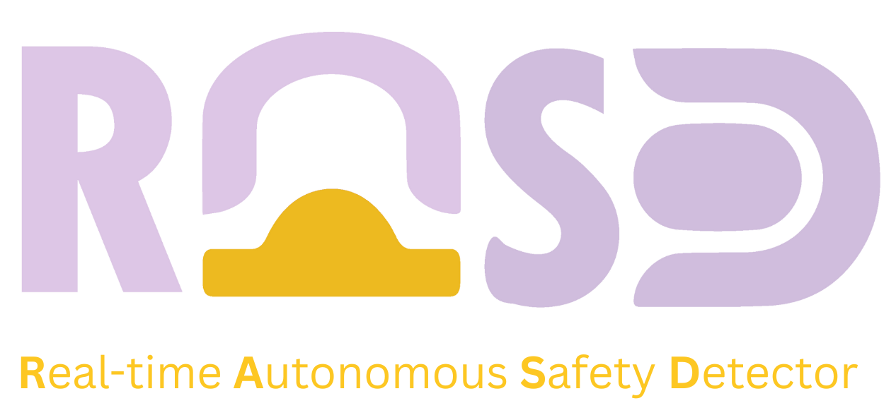

# Real-Time Autonomous Safety Detector (RASD)

The **Real-Time Autonomous Safety Detector** is an AI-powered road anomaly detection system designed for Shell Eco-Marathon and autonomous safety applications.  
It integrates:

- **LiDAR-based speed bump detection**
- **Camera-based pothole detection**
- **Real-time driver alert logic**
- **Cloud dashboard reporting**

This repository contains the ROS2 nodes, detection models, Google Colab training notebooks, and all project documentation.

---

# 📌 Prioritized User Story Backlog

## User Stories Table

| ID  | Title                                                   | User Story (IEEE format)                                                                                                                                                                                 | Priority | Acceptance Criteria                                                                                                                                                                                                                                                   |
| --- | ------------------------------------------------------- | -------------------------------------------------------------------------------------------------------------------------------------------------------------------------------------------------------- | -------- | --------------------------------------------------------------------------------------------------------------------------------------------------------------------------------------------------------------------------------------------------------------------- |
| **S1**  | Speed Bump Detection Morning                            | As a driver commuting in the morning, I want the system to detect speed bumps so that I can slow down safely.                                                                                            | High     | System detects speed bumps under normal visibility. Driver is prompted to reduce speed before crossing.                                                                                                                                                             |
| **P1**  | Pothole Detection at Morning                            | As a driver commuting in the morning, I want the system to detect potholes ahead so that I can reduce speed smoothly.                                                                                    | High     | System detects potholes in clear conditions. Driver is alerted early enough to reduce speed safely. Pothole is logged with GPS for reporting.                                                                                                                    |
| **S2**  | Speed Bump Detection Night                              | As a driver at night, I want the system to recognize even unmarked bumps so that I am warned early.                                                                                                      | High     | System identifies both marked and unmarked bumps at night. Driver receives a clear and timely warning. Detection accuracy remains high.                                                                                                                         |
| **P2**  | Pothole Detection at Night                              | As a driver traveling at night, I want the system to detect potholes in low visibility so that I can avoid sudden swerves.                                                                               | High     | System functions reliably under low-light conditions. Driver is alerted early enough to reduce speed safely. Pothole is logged with GPS and timestamp for reporting.                                                                                            |
| **Ex1** | Extreme Weather Detection                               | As a driver in rain or sandstorms, I want bumps and potholes detected so that I can ensure safety.                                                                                                       | Medium   | Detection accuracy remains acceptable in rain or dust. Alerts are still delivered in real time.                                                                                                                                                                     |
| **D1**  | Municipality Dashboard Map Integration                  | As a Riyadh Municipality road maintenance officer, I want the system to display detected potholes on a live dashboard map so that I can identify hazardous locations and prioritize repairs efficiently. | Low      | Dashboard shows all potholes detected within Riyadh. Each pothole appears with location + timestamp. Users can filter potholes by date or status (unresolved/resolved).                                                                                          |

---

# 📌 Non-Functional Requirements

### **Reliability**
- System must operate continuously for 24/7 usage in city-wide deployment.
- Sensor fusion must remain stable even under vibration and high temperatures.

### **Usability**
- Alerts must be simple, color-coded, and instantly clear to the driver.
- Visualizations on the dashboard must be intuitive and easy to interpret.

### **Scalability**
- Capable of handling large volumes of anomaly detections across multiple users.
- Dashboard back-end supports real-time updates from many vehicles.

### **Maintainability**
- ROS2 nodes must be modular and easy to update.
- YOLO and LiDAR algorithms should be replaceable without breaking the pipeline.

---

# 📌 System Overview (High-Level Summary)

The RASD system consists of:

### **1. LiDAR Speed Bump Detection (ROS2 C++ Node)**
- ROI filtering  
- Ground plane estimation  
- Elevation-profile analysis  
- Early vs. strong confidence detection  
- RViz markers + LED alert pipeline  

### **2. Camera Pothole Detection (YOLOv11/12)**
- Global-shutter camera  
- ROI cropping  
- ByteTrack temporal filtering  
- EMA smoothing for stability  
- Optimized for Jetson Orin Nano  

### **3. Sensor Fusion Node**
Combines:
- LiDAR bump confidence  
- YOLO pothole detections  
- Distance estimation  
- Temporal filtering  
- Single unified warning output  

### **4. LED Alert Node**
- Green / Yellow / Red alert system  
- Configurable distance thresholds  
- Serial or SPI communication  

### **5. Cloud Reporting (Optional)**
- MQTT telemetry  
- Plotly dashboard  
- GPS logging  
- Municipality reporting API  

---

# 📌 Repository Structure

